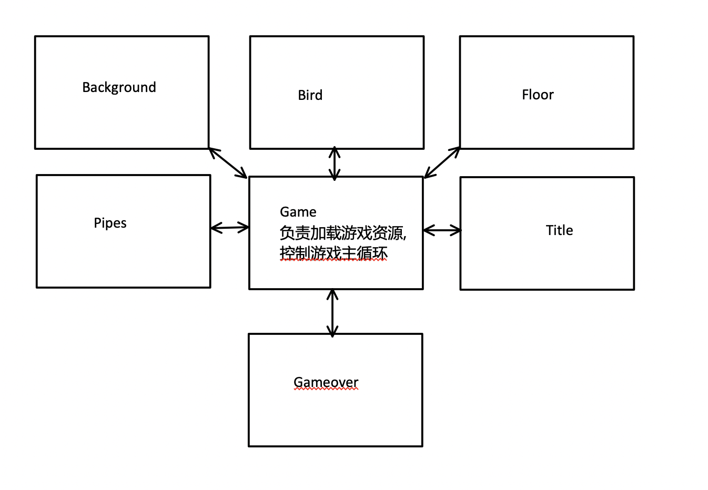

# flappy bird项目总结
## 因为DOM操作在性能上消耗比较大所以选用Canvas上实现
|遇到的技术难点|具体|
|-|-|
|Canvas和DOM在动画实现上的不同|因为Canvas上是对像素的不断重绘, 所以不能像DOM操作那样选择元素进行操作|
|Canvas的rotate, scale, translate等API|每次变形都要通过translate重新计算画布坐标, 而且不能通过F12来排查, 只能一点一点尝试|
|游戏的代码框架|游戏里面只存在一个主循环, 主循环开始意味着游戏开始. 游戏里面的每一个元素都有自己的行为逻辑, 如果对其他游戏元素有访问需求, 通过访问Game类来实现|
|游戏的资源的加载|为避免贴图出现缺失, 采用预加载的方式进行游戏资源加载|

## 游戏代码结构

* Game类为总开关, 负责游戏主循环, 其中有负责存放每个元素的数组, 每个在画面中呈现的游戏元素必须放进其中, 并为其他游戏元素提供可以访问的API
* 其他游戏元素都只能通过Game类访问其他游戏元素, 以便维护

## Game class
```
class Game{
    constructor(id){
        游戏资源加载,
        调用getData
    }

    getData(callback){
        通过Ajax调用图片加载, 加载完成后调用init方法
    }


    init(){
        游戏的初始化
       
        this.timer = setInterval(() => {
           开始游戏的主循环, 循环中遍历每个游戏元素, 
           调用其update, render方法

        }, this._interval);
    }

    //Game starts!!
    start(){
       负责游戏重新开始的变量重设
        
    }
}
```

## 游戏元素框架
* 每个游戏内的元素都继承GameElement类, 都有这update和render方法. update方法负责更新x,y坐标, 计算碰撞检测等功能, render负责把更新后的数据渲染到画布中.
```
class GameElement{
    constructor(){
        //每个新建元素都会加进game类的gameItem数组中
        game.gameItems.push(this);
    }

    update(){
        //通过update方法更新参数
    }
    render(){
        throw new Error('render function must be rewritten.');
    }

    getRdm(min, max){
        return Math.floor(Math.random()*(max-min+1)+min)
    }
}
```